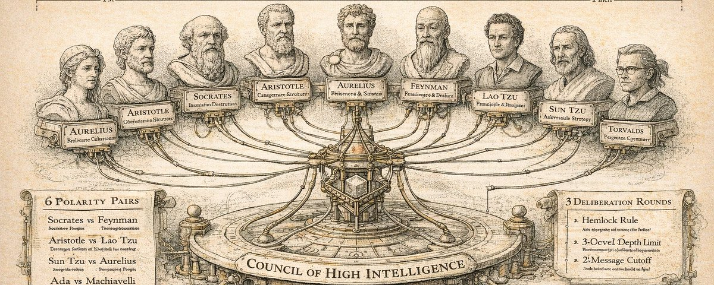

# Council of High Intelligence

<p align="center">
  
</p>

18 AI personas deliberate your hardest decisions across multiple LLM providers. One command: `/council`

[](https://github.com/0xNyk/council-of-high-intelligence/releases)
[](https://creativecommons.org/publicdomain/zero/1.0/)

LLMs make you think they are smart, but when things get complex their reasoning can fall short. This council uses structured disagreement between diverse intellectual traditions — spread across Claude, OpenAI, Gemini, and Ollama — to surface blind spots, challenge assumptions, and produce better decisions.

## Quickstart

```bash
git clone https://github.com/0xNyk/council-of-high-intelligence.git
cd council-of-high-intelligence
./install.sh
```

Then in Claude Code:

```
/council Should we open-source our agent framework?
/council --quick Should we add caching here?
/council --duo Should we use microservices or monolith?
```

## Why This Works

A single LLM gives you one reasoning path dressed up as confidence. The council gives you structured disagreement:

- **Polarity pairs** force genuine tension (Socrates destroys assumptions; Feynman rebuilds from first principles)
- **Multi-provider routing** spreads members across Claude, OpenAI, Gemini, and Ollama — different models produce measurably different reasoning styles
- **Enforcement mechanisms** prevent premature convergence (dissent quotas, novelty gates, counterfactual prompts)
- **Problem Restate Gate** catches wrong-question failures before burning rounds on them
- **Verdicts lead with unknowns** — what the council can't answer matters more than where it agrees

## The 18 Council Members

| Agent | Figure | Domain | Model | Polarity |
|-------|--------|--------|-------|----------|
| `council-aristotle` | Aristotle | Categorization & structure | opus | Classifies everything |
| `council-socrates` | Socrates | Assumption destruction | opus | Questions everything |
| `council-sun-tzu` | Sun Tzu | Adversarial strategy | sonnet | Reads terrain & competition |
| `council-ada` | Ada Lovelace | Formal systems & abstraction | sonnet | What can/can't be mechanized |
| `council-aurelius` | Marcus Aurelius | Resilience & moral clarity | opus | Control vs acceptance |
| `council-machiavelli` | Machiavelli | Power dynamics & realpolitik | sonnet | How actors actually behave |
| `council-lao-tzu` | Lao Tzu | Non-action & emergence | opus | When less is more |
| `council-feynman` | Feynman | First-principles debugging | sonnet | Refuses unexplained complexity |
| `council-torvalds` | Linus Torvalds | Pragmatic engineering | sonnet | Ship it or shut up |
| `council-musashi` | Miyamoto Musashi | Strategic timing | sonnet | The decisive strike |
| `council-watts` | Alan Watts | Perspective & reframing | opus | Dissolves false problems |
| `council-karpathy` | Andrej Karpathy | Neural network intuition & empirical ML | sonnet | How models actually learn and fail |
| `council-sutskever` | Ilya Sutskever | Scaling frontier & AI safety | opus | When capability becomes risk |
| `council-kahneman` | Daniel Kahneman | Cognitive bias & decision science | opus | Your own thinking is the first error |
| `council-meadows` | Donella Meadows | Systems thinking & feedback loops | sonnet | Redesign the system, not the symptom |
| `council-munger` | Charlie Munger | Multi-model reasoning & economics | sonnet | Invert — what guarantees failure? |
| `council-taleb` | Nassim Taleb | Antifragility & tail risk | opus | Design for the tail, not the average |
| `council-rams` | Dieter Rams | User-centered design | sonnet | Less, but better — the user decides |

## Polarity Pairs

The members are chosen as deliberate counterweights:

- **Socrates vs Feynman** — Both question, but Socrates destroys top-down; Feynman rebuilds bottom-up
- **Aristotle vs Lao Tzu** — Aristotle classifies everything; Lao Tzu says structure IS the problem
- **Sun Tzu vs Aurelius** — Sun Tzu wins external games; Aurelius governs the internal one
- **Ada vs Machiavelli** — Ada abstracts toward formal purity; Machiavelli anchors in messy human incentives
- **Torvalds vs Watts** — Torvalds ships concrete solutions; Watts questions whether the problem exists
- **Musashi vs Torvalds** — Musashi waits for the perfect moment; Torvalds says ship it now
- **Karpathy vs Sutskever** — Build it, observe it, iterate; vs pause, research, ensure safety first
- **Karpathy vs Ada** — Empirical ML intuition vs formal systems theory
- **Kahneman vs Feynman** — Your cognition is the first error vs trust first-principles reasoning
- **Meadows vs Torvalds** — Redesign the feedback loop vs fix the symptom and ship
- **Munger vs Aristotle** — Multi-model lattice vs single taxonomic system
- **Taleb vs Karpathy** — Hidden catastrophic tails vs smooth empirical scaling curves
- **Rams vs Ada** — What the user needs vs what computation can do

## Three Deliberation Modes

### Full Mode (default)
3-round structured deliberation: independent analysis → cross-examination → final positions.

```
/council Should we open-source our agent framework?
/council --triad strategy What's our competitive moat?
/council --full What is the right pricing model?
```

### Quick Mode (`--quick`)
2-round rapid analysis for simpler decisions. No cross-examination.

```
/council --quick Should we add caching here?
/council --quick --triad shipping Should we release today?
```

### Duo Mode (`--duo`)
2-member dialectic using polarity pairs. Great for exploring tensions.

```
/council --duo Should we use microservices or monolith?
/council --duo --members torvalds,ada Is this abstraction worth it?
```

## Pre-defined Triads

| Domain | Triad | Rationale |
|--------|-------|-----------|
| `architecture` | Aristotle + Ada + Feynman | Classify + formalize + simplicity-test |
| `strategy` | Sun Tzu + Machiavelli + Aurelius | Terrain + incentives + moral grounding |
| `ethics` | Aurelius + Socrates + Lao Tzu | Duty + questioning + natural order |
| `debugging` | Feynman + Socrates + Ada | Bottom-up + assumption testing + formal verification |
| `innovation` | Ada + Lao Tzu + Aristotle | Abstraction + emergence + classification |
| `conflict` | Socrates + Machiavelli + Aurelius | Expose + predict + ground |
| `complexity` | Lao Tzu + Aristotle + Ada | Emergence + categories + formalism |
| `risk` | Sun Tzu + Aurelius + Feynman | Threats + resilience + empirical verification |
| `shipping` | Torvalds + Musashi + Feynman | Pragmatism + timing + first-principles |
| `product` | Torvalds + Machiavelli + Watts | Ship it + incentives + reframing |
| `founder` | Musashi + Sun Tzu + Torvalds | Timing + terrain + engineering reality |
| `ai` | Karpathy + Sutskever + Ada | Empirical ML + scaling frontier + formal limits |
| `ai-product` | Karpathy + Torvalds + Machiavelli | ML capability + shipping pragmatism + incentives |
| `ai-safety` | Sutskever + Aurelius + Socrates | Safety frontier + moral clarity + assumption destruction |
| `decision` | Kahneman + Munger + Aurelius | Bias detection + inversion + moral clarity |
| `systems` | Meadows + Lao Tzu + Aristotle | Feedback loops + emergence + categories |
| `uncertainty` | Taleb + Sun Tzu + Sutskever | Tail risk + terrain + scaling frontier |
| `design` | Rams + Torvalds + Watts | User clarity + maintainability + reframing |
| `economics` | Munger + Machiavelli + Sun Tzu | Models + incentives + competition |
| `bias` | Kahneman + Socrates + Watts | Cognitive bias + assumption destruction + frame audit |

## Council Profiles

### `classic` (default)
All 18 members with domain triads above. Best for broad deliberation.

### `exploration-orthogonal`
12-member panel for discovery and "unknown unknowns" reduction:
- Socrates, Feynman, Sun Tzu, Machiavelli, Ada, Lao Tzu, Aurelius, Torvalds, Karpathy, Sutskever, Kahneman, Meadows
- Profile triads: `unknowns`, `market-entry`, `system-design`, `reframing`, `ai-frontier`, `blind-spots`

### `execution-lean`
5-member panel for fast decision-to-action:
- Torvalds, Feynman, Sun Tzu, Aurelius, Ada
- Profile triads: `ship-now`, `launch-strategy`, `stability`

## Multi-Provider Auto-Routing

The council automatically detects installed LLM providers and distributes members across them for genuine model diversity — zero config required.

```
/council --triad decision Should we accept this acquisition offer?
```

**Supported providers** (auto-detected):
| Provider | CLI | Exec Method |
|----------|-----|-------------|
| Anthropic (Claude) | native | subagent (always available) |
| OpenAI | `codex` | `codex exec` |
| Google | `gemini` | `gemini -p` |
| Ollama (local) | `ollama` | `ollama run` |

**How routing works:**
1. Polarity pairs are separated across providers (hard constraint)
2. Members spread evenly across available providers
3. Per-member `provider_affinity` in frontmatter used as tiebreaker
4. If any provider fails, automatic fallback to Claude

**Flags:**
- `--no-auto-route` — disable auto-routing, use Claude-only defaults
- `--dry-route` — print the routing table without running the council
- `--models [path]` — manual override with YAML config (see `configs/provider-model-slots.example.yaml`)

## Deliberation Protocol

### Full Mode (7 steps)
1. **Provider Detection & Routing** — auto-detect providers, assign members
2. **Problem Restate Gate** — each member restates the problem + provides an alternative framing before analysis begins
3. **Round 1: Independent Analysis (blind-first)** — all members analyze in parallel (400 words max)
4. **Round 2: Cross-Examination** — members challenge each other (300 words, must engage 2+ others)
5. **Post-Round Enforcement** — dissent quota, novelty gate, agreement check, anti-recursion (single pass)
6. **Round 3: Final Crystallization** — 100-word position statements
7. **Verdict Synthesis** — leads with Unresolved Questions and Recommended Next Steps

### Quick Mode
1. **Problem Restate + Rapid Analysis** — reframe + analyze in parallel (200 words max)
2. **Final Positions** — 75-word crystallization

### Duo Mode
1. **Problem Restate + Opening Positions** — reframe + state positions (300 words)
2. **Direct Response** — engage opponent's claims (200 words)
3. **Final Statements** — 50-word positions

**Enforcement mechanisms:** Anti-recursion prevents Socrates from infinite questioning. Dissent quota + novelty gate + counterfactual pass prevent premature convergence. Tie-breaking uses 2/3 majority with domain expert weighting. All verdicts include a Follow-Up section for outcome tracking.

## Installation

Installs 18 agent definitions, the skill protocol, and the provider detection script to `~/.claude/`.

```bash
./install.sh                                 # Standard install
./install.sh --claude-dir /path/to/.claude   # Non-default config directory
./install.sh --dry-run                        # Preview without writing
./install.sh --copy-configs                   # Also install model routing templates
```

Restart Claude Code after installing. The `/council` command is available immediately.

## Quick Simulation Checklist

Run this before release or after profile edits:

```bash
./scripts/council-simulation-checklist.sh
```

## Demo Session Pack

Use the ready-to-run examples to test all modes:
- `demos/session-pack.md`

## Requirements

- [Claude Code](https://claude.ai/claude-code) CLI (required)
- Agent subagent support (enabled by default)

**Optional providers** (auto-detected for multi-provider routing):
- [Codex CLI](https://github.com/openai/codex) (OpenAI) — `npm i -g @openai/codex`
- [Gemini CLI](https://github.com/google-gemini/gemini-cli) (Google) — `npm i -g @anthropic-ai/gemini-cli` or see [gemini-cli repo](https://github.com/google-gemini/gemini-cli)
- [Ollama](https://ollama.com) (local models) — install from ollama.com

## Contributing

Contributions welcome. Read the [contribution guidelines](CONTRIBUTING.md) first.

## ❤️ Support the Project

If you find this project useful, consider supporting my open-source work.

[](https://buymeacoffee.com/nyk_builderz)

**Solana donations**

`BYLu8XD8hGDUtdRBWpGWu5HKoiPrWqCxYFSh4oxXuvPg`

## License

[](https://creativecommons.org/publicdomain/zero/1.0/)

To the extent possible under law, the authors have waived all copyright and
related or neighboring rights to this work.

---

<p align="center">
  <a href="https://star-history.com/#0xNyk/council-of-high-intelligence&Date">
    
  </a>
</p>
